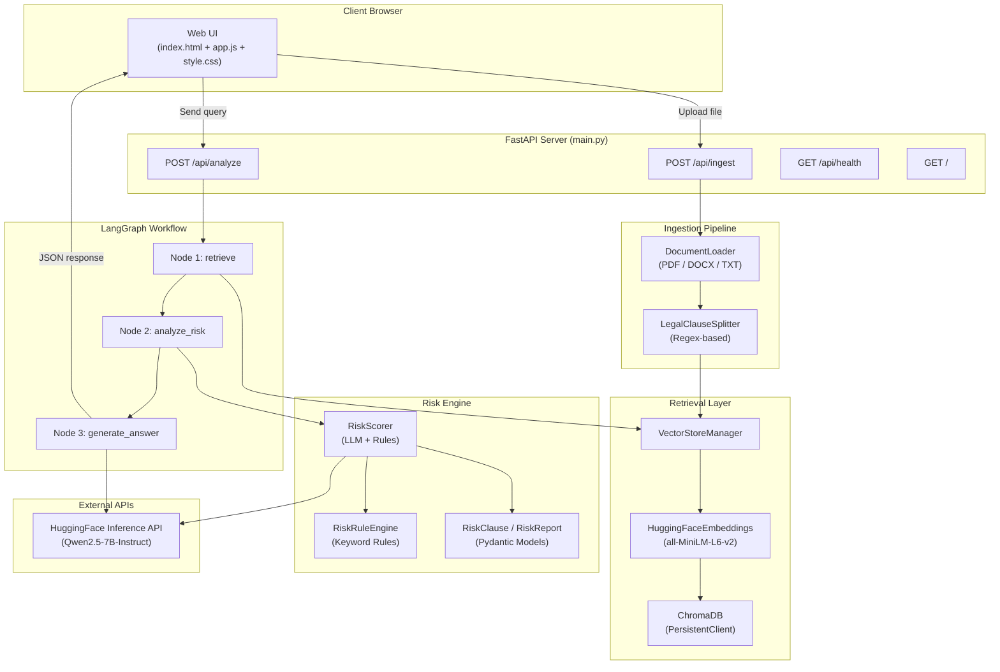
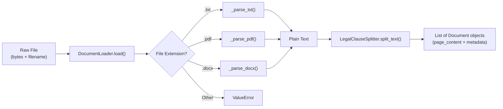
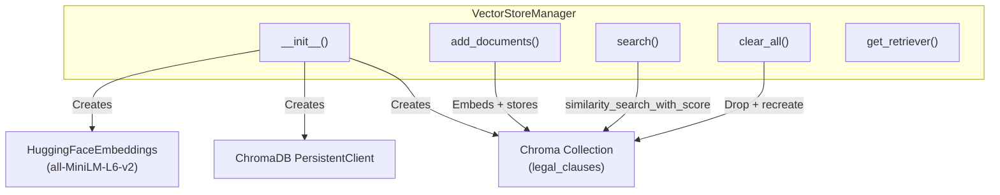
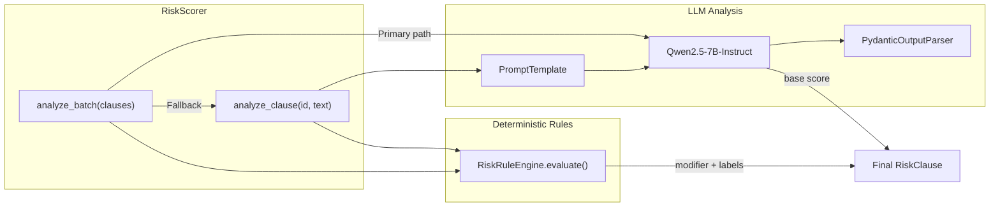
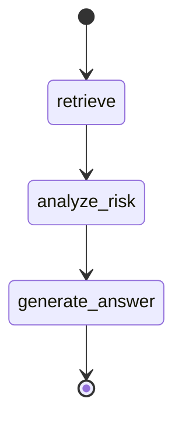
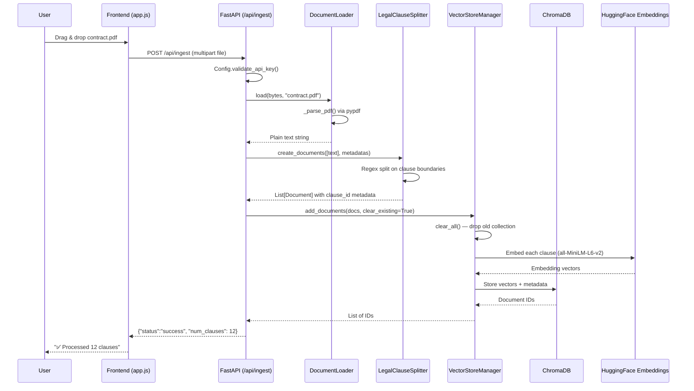
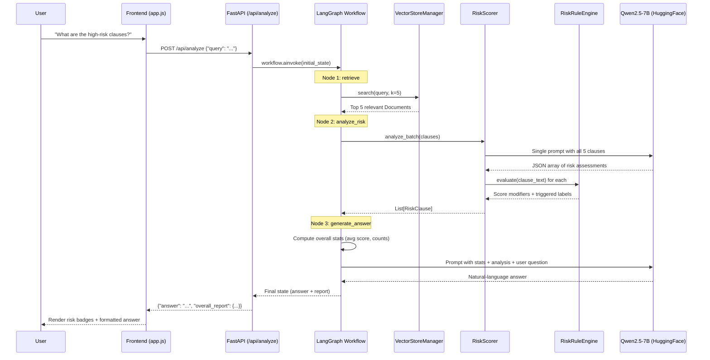
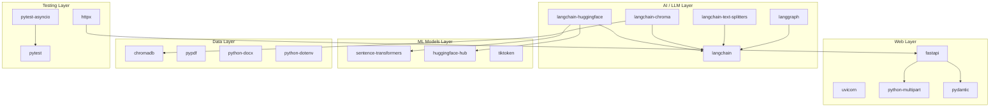
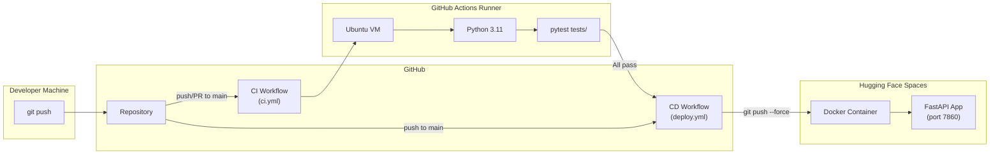

# AI Legal Policy & Document Analyzer — Complete Project Report

---

## 1. Project Overview

The **AI Legal Policy and Document Analyzer** is a full-stack web application that uses Retrieval-Augmented Generation (RAG) and a hybrid risk-scoring engine to analyze legal contracts. A user uploads a legal document (PDF, DOCX, or TXT), the system splits it into semantic clauses, embeds them into a vector database, and then answers natural-language questions about the contract while simultaneously producing a per-clause risk assessment.

| Attribute | Value |
|---|---|
| **Language** | Python 3.11 |
| **Framework** | FastAPI (async REST API) |
| **AI Stack** | LangChain + LangGraph + HuggingFace LLMs |
| **Vector DB** | ChromaDB (local persistent) |
| **Embeddings** | `all-MiniLM-L6-v2` (Sentence-Transformers) |
| **LLM** | `Qwen/Qwen2.5-7B-Instruct` (via HuggingFace Inference API) |
| **Frontend** | Vanilla HTML / CSS / JavaScript |
| **Deployment** | Docker → Hugging Face Spaces |
| **CI/CD** | GitHub Actions (`ci.yml` + `deploy.yml`) |

---

## 2. High-Level Architecture



---

## 3. Repository Structure

```
AI-Legal-Policy-and-Document-Analyzer/
├── .env                          # API keys (git-ignored)
├── .gitignore                    # Exclusion rules
├── .github/
│   └── workflows/
│       ├── ci.yml                # CI pipeline (pytest on push/PR)
│       └── deploy.yml            # CD pipeline (sync to HF Spaces)
├── Dockerfile                    # Container config for HF Spaces
├── README.md                     # Project readme
├── RISK_ANALYSIS.md              # Risk analysis documentation
├── architecture_and_design.md    # Design notes
├── pyproject.toml                # pytest-asyncio configuration
├── requirements.txt              # All dependencies (runtime + dev)
│
├── main.py                       # FastAPI app (primary entry point)
├── web_server.py                 # Alternative dev server (port 8001)
│
├── src/
│   ├── __init__.py
│   ├── ingestion/
│   │   ├── __init__.py
│   │   ├── ingestion_loader.py   # DocumentLoader (PDF/DOCX/TXT)
│   │   └── legal_splitter.py     # LegalClauseSplitter (regex)
│   ├── retrieval/
│   │   ├── __init__.py
│   │   └── vector_storage.py     # VectorStoreManager (ChromaDB)
│   ├── risk_engine/
│   │   ├── __init__.py
│   │   ├── risk_models.py        # RiskClause, RiskReport (Pydantic)
│   │   ├── risk_rules.py         # RiskRuleEngine (keyword rules)
│   │   └── risk_scorer.py        # RiskScorer (LLM + rules hybrid)
│   ├── utils/
│   │   ├── __init__.py
│   │   └── project_config.py     # Config (env vars, model names)
│   └── workflows/
│       ├── __init__.py
│       ├── workflow_graph.py     # LangGraph StateGraph builder
│       └── workflow_nodes.py     # Node functions + GraphState
│
├── web/
│   ├── index.html                # Single-page frontend
│   └── static/
│       ├── css/style.css         # UI styling (dark theme)
│       └── js/app.js             # Frontend logic (fetch API)
│
├── samples/                      # Sample legal documents
│   ├── saas_contract.txt
│   ├── sample_nda.txt
│   ├── sample_privacy_policy.txt
│   └── sample_vendor_agreement.txt
│
└── tests/
    ├── __init__.py
    ├── conftest.py               # Shared pytest fixtures
    ├── test_api_endpoints.py     # API endpoint tests (7 tests)
    ├── test_risk_engine.py       # Risk engine tests (13 tests)
    ├── test_splitter.py          # Splitter tests (9 tests)
    ├── test_workflow_graph.py    # Workflow tests (5 tests)
    └── test_scenarios.py         # Manual integration script
```

---

## 4. Component-by-Component Deep Dive

### 4.1 Configuration Layer

#### [`src/utils/project_config.py`](file:///c:/Users/apex/Desktop/Project/AI-Legal-Policy-and-Document-Analyzer/src/utils/project_config.py)

The `Config` class is the single source of truth for all environment-specific settings. It loads variables from the `.env` file using `python-dotenv` and exposes them as class attributes.

| Setting | Value | Purpose |
|---|---|---|
| `HUGGINGFACEHUB_API_TOKEN` | From `.env` | Authenticates with HuggingFace Inference API |
| `CHROMA_PERSIST_DIRECTORY` | `<project_root>/chroma_db/` | Local directory for ChromaDB persistence |
| `EMBEDDING_MODEL` | `all-MiniLM-L6-v2` | Sentence-Transformer model for clause embeddings |
| `LLM_SCAN_MODEL` | `Qwen/Qwen2.5-7B-Instruct` | LLM used for risk analysis (batch clause scanning) |
| `LLM_REASONING_MODEL` | `Qwen/Qwen2.5-7B-Instruct` | LLM used for final answer generation |

**`validate_api_key()`** — A classmethod that raises `ValueError` if the token is missing, empty, or a placeholder. Called at the start of every `/api/ingest` request.

#### [`.env`](file:///c:/Users/apex/Desktop/Project/AI-Legal-Policy-and-Document-Analyzer/.env) (git-ignored)

```
GOOGLE_API_KEY=<key>
HUGGINGFACEHUB_API_TOKEN=<token>
```

Sensitive credentials are isolated here and excluded from version control via `.gitignore`.

---

### 4.2 Ingestion Pipeline

The ingestion pipeline converts raw uploaded files into semantically chunked `Document` objects ready for vector storage.



#### [`src/ingestion/ingestion_loader.py`](file:///c:/Users/apex/Desktop/Project/AI-Legal-Policy-and-Document-Analyzer/src/ingestion/ingestion_loader.py) — `DocumentLoader`

A static utility class that normalises any supported file format into plain text.

| Method | Input | Output | Logic |
|---|---|---|---|
| `load(file_obj, filename)` | `bytes` or `BinaryIO` + filename string | `str` (full text) | Routes to format-specific parser based on file extension |
| `_parse_txt(file_obj)` | `BinaryIO` | `str` | Decodes as UTF-8, falls back to Latin-1 |
| `_parse_pdf(file_obj)` | `BinaryIO` | `str` | Uses `pypdf.PdfReader` to extract text from every page |
| `_parse_docx(file_obj)` | `BinaryIO` | `str` | Uses `python-docx` to join all paragraph texts |

**Error handling**: Raises `ValueError` for unsupported formats. PDF/DOCX parsing failures are caught and re-raised as `ValueError` with descriptive messages.

#### [`src/ingestion/legal_splitter.py`](file:///c:/Users/apex/Desktop/Project/AI-Legal-Policy-and-Document-Analyzer/src/ingestion/legal_splitter.py) — `LegalClauseSplitter`

A custom `TextSplitter` (extends LangChain's base class) that uses **compiled regex patterns** to split legal text on clause boundaries.

**Recognised patterns** (compiled with `re.IGNORECASE | re.MULTILINE`):

| Pattern | Example Match |
|---|---|
| `^\s*ARTICLE\s+[IVX0-9]+` | `ARTICLE I`, `ARTICLE IV`, `ARTICLE 3` |
| `^\s*SECTION\s+[0-9]+(\.[0-9]+)*` | `SECTION 1`, `SECTION 2.3` |
| `^\s*[0-9]+\.[0-9]+(\.[0-9]+)*` | `1.1`, `2.3.1`, `10.4.2` |
| `^\s*[0-9]+\.\s+[A-Z]` | `3. Definitions`, `1. Term` |

**`split_text(text)`** — Iterates through lines; when a line matches a pattern it starts a new chunk. Returns `List[str]`.

**`create_documents(texts, metadatas)`** — Wraps `split_text()` and produces `List[Document]` objects. Each document gets:
- `page_content`: the clause text
- `metadata.clause_id`: extracted from the regex match (e.g., `"1.1"`, `"ARTICLE II"`) or `"Intro"` if no pattern matched
- Any additional metadata from the caller (e.g., `{"source": "contract.pdf"}`)

---

### 4.3 Retrieval Layer (Vector Storage)

#### [`src/retrieval/vector_storage.py`](file:///c:/Users/apex/Desktop/Project/AI-Legal-Policy-and-Document-Analyzer/src/retrieval/vector_storage.py) — `VectorStoreManager`

Manages the ChromaDB vector store for semantic similarity search over legal clauses.



| Method | Input | Output | Description |
|---|---|---|---|
| `__init__()` | — | — | Creates embeddings model, ChromaDB persistent client, and Chroma collection. Auto-resets DB if initialisation fails. |
| `add_documents(docs, clear_existing)` | `List[Document]`, `bool` | `List[str]` (IDs) | Embeds and stores documents. Optionally clears existing data first. |
| `search(query, k)` | Query `str`, top-k `int` | `List[(Document, float)]` | Returns top-k most similar clauses with cosine similarity scores. |
| `clear_all()` | — | — | Drops and recreates the `legal_clauses` collection. |
| `get_retriever(k)` | top-k `int` | `VectorStoreRetriever` | Returns a LangChain-compatible retriever interface. |

**Key design**: The collection name is hardcoded as `legal_clauses`. When a new document is ingested, `clear_existing=True` wipes the previous document's embeddings so the vector store always represents the most recently ingested document.

---

### 4.4 Risk Engine

The risk engine is the analytical core. It combines LLM-based clause analysis with a deterministic keyword-based rule engine for a **hybrid scoring approach**.



#### [`src/risk_engine/risk_models.py`](file:///c:/Users/apex/Desktop/Project/AI-Legal-Policy-and-Document-Analyzer/src/risk_engine/risk_models.py) — Pydantic Data Models

**`RiskClause`** — The structured output for a single analysed clause:

| Field | Type | Constraints | Description |
|---|---|---|---|
| `clause_id` | `str` | Required | Clause number or identifier (e.g., `"1.1"`, `"Section 5"`) |
| `clause_type` | `str` | Required | Category (e.g., `"Indemnity"`, `"Liability Cap"`, `"Termination"`) |
| `risk_level` | `str` | Required | `"High"`, `"Medium"`, or `"Low"` |
| `risk_score` | `int` | `ge=1, le=10` | Numeric risk score (1 = lowest, 10 = highest) |
| `reason` | `str` | Required | Plain-English explanation of the risk |
| `recommendation` | `str` | Required | Actionable advice to mitigate the risk |

**`RiskReport`** — Aggregate report for an entire document:

| Field | Type | Description |
|---|---|---|
| `document_id` | `str` | Document identifier |
| `overall_risk_score` | `float` | Weighted average of clause scores |
| `high_risk_clauses` | `List[RiskClause]` | All clauses scoring ≥ 8 |
| `medium_risk_clauses` | `List[RiskClause]` | All clauses scoring 5–7 |
| `low_risk_clauses` | `List[RiskClause]` | All clauses scoring 1–4 |

#### [`src/risk_engine/risk_rules.py`](file:///c:/Users/apex/Desktop/Project/AI-Legal-Policy-and-Document-Analyzer/src/risk_engine/risk_rules.py) — `RiskRuleEngine`

A deterministic, keyword-based scoring system that acts as a **safety net** alongside LLM analysis. Ensures critical risk patterns are never missed, even if the LLM hallucinates.

| Required Keywords | Score Modifier | Label | Risk Rationale |
|---|---|---|---|
| `indemnify` + `unlimited` | **+7** | Unlimited indemnity | Unrestricted financial exposure |
| `liability` + `cap` | **−2** | Liability cap present | Risk is mitigated by a cap |
| `termination` + `convenience` | **+3** | Termination for convenience | Contract can be ended without cause |
| `auto-renew` | **+2** | Auto-renewal clause | May lock into unwanted extensions |
| `confidential` + `survival` | **+1** | Confidentiality survival | Obligations persist after termination |
| `no warranty` + `as is` | **+2** | Warranty disclaimer | No quality guarantees |
| `governing law` | **−1** | Governing law defined | Legal clarity reduces ambiguity |

**`evaluate(text)`** — Scans text (case-insensitive) against all rules. Returns `(total_modifier: int, triggered_labels: List[str])`.

#### [`src/risk_engine/risk_scorer.py`](file:///c:/Users/apex/Desktop/Project/AI-Legal-Policy-and-Document-Analyzer/src/risk_engine/risk_scorer.py) — `RiskScorer`

The main scorer that orchestrates LLM-based analysis and deterministic rule evaluation.

**Two analysis modes:**

| Mode | Method | When Used | API Calls |
|---|---|---|---|
| **Batch** (preferred) | `analyze_batch(clauses)` | Always attempted first | 1 LLM call for all clauses |
| **Single** (fallback) | `analyze_clause(id, text)` | Only if batch JSON parsing fails | 1 LLM call per clause |

**Batch analysis flow:**
1. Format all clauses into a single prompt requesting a JSON array.
2. Send to Qwen2.5-7B-Instruct via HuggingFace Inference API.
3. Extract the JSON array from the response (strips markdown fences if present).
4. Parse each item into a `RiskClause` object.
5. Apply `RiskRuleEngine.evaluate()` to each clause's original text — adjusts the score and appends triggered rule labels.
6. Clamp final score to `[1, 10]` and recalculate risk level: `≥8 → High`, `≥5 → Medium`, `<5 → Low`.

**Fallback**: If batch parsing fails (malformed JSON, API error), falls back to `asyncio.gather()` over individual `analyze_clause()` calls.

---

### 4.5 LangGraph Workflow (State Machine)

The workflow orchestrates the three-stage analysis pipeline as a **directed acyclic graph** using LangGraph's `StateGraph`.

#### [`src/workflows/workflow_graph.py`](file:///c:/Users/apex/Desktop/Project/AI-Legal-Policy-and-Document-Analyzer/src/workflows/workflow_graph.py)



**`create_workflow()`** builds and compiles the graph:
1. Creates a `StateGraph(GraphState)`.
2. Adds three nodes: `retrieve`, `analyze_risk`, `generate_answer`.
3. Sets `retrieve` as the entry point.
4. Wires linear edges: `retrieve → analyze_risk → generate_answer → END`.
5. Returns the compiled graph (supports both `invoke()` and `ainvoke()`).

#### [`src/workflows/workflow_nodes.py`](file:///c:/Users/apex/Desktop/Project/AI-Legal-Policy-and-Document-Analyzer/src/workflows/workflow_nodes.py) — `GraphState` & `LegalNodes`

**`GraphState`** — A `TypedDict` defining the data that flows through the graph:

| Key | Type | Purpose |
|---|---|---|
| `query` | `str` | User's natural-language question |
| `documents` | `list` | Retrieved `Document` objects |
| `risk_analysis` | `List[Any]` | List of `RiskClause` results |
| `final_answer` | `str` | Generated plain-English answer |
| `overall_report` | `Dict[str, Any]` | Aggregate risk statistics |

**`LegalNodes`** — Contains the three async node functions:

| Node | Function | Input State Keys | Output State Keys | What It Does |
|---|---|---|---|---|
| `retrieve` | `LegalNodes.retrieve()` | `query` | `documents` | Runs `VectorStoreManager.search(query, k=5)` to get the 5 most relevant clauses |
| `analyze_risk` | `LegalNodes.analyze_risk()` | `documents` | `risk_analysis` | Passes clauses to `RiskScorer.analyze_batch()`, returns list of `RiskClause` |
| `generate_answer` | `LegalNodes.generate_answer()` | `risk_analysis`, `query` | `final_answer`, `overall_report` | Builds a prompt with risk stats + clause analysis, sends to Qwen2.5-7B-Instruct, returns natural-language answer |

**Answer generation prompt structure:**
```
You are a helpful and expert legal document assistant.
User question: '{query}'

--- Document Risk Statistics ---
Overall Risk Score: X/10
Critical (High) Risks: N
Medium Risks: N
Low Risks: N

--- Clause Analysis ---
- Clause 1.1 (High, Score: 8/10): Reason
  Recommendation: Advice
...

--- Instructions ---
1. Identify document type
2. Use plain language
3-6. Formatting and response rules
```

---

### 4.6 FastAPI REST API

#### [`main.py`](file:///c:/Users/apex/Desktop/Project/AI-Legal-Policy-and-Document-Analyzer/main.py) — Primary Application Entry Point

| Endpoint | Method | Input | Output | Description |
|---|---|---|---|---|
| `/` | `GET` | — | `HTMLResponse` | Serves the frontend (`web/index.html`) |
| `/api/ingest` | `POST` | `UploadFile` (multipart form) | `{"status", "num_clauses", "filename", "message"}` | Validates API key, parses file, splits into clauses, stores in ChromaDB |
| `/api/analyze` | `POST` | `{"query": str}` (JSON body) | `{"status", "answer", "overall_report", "num_clauses_analyzed"}` | Runs the full LangGraph workflow and returns the answer |
| `/api/health` | `GET` | — | `{"status": "ok", "version": "1.0.0"}` | Health check for monitoring |
| `/static/*` | `GET` | — | Static files | Serves CSS and JS assets |

**Error handling:**
- Unsupported file formats → `400` with descriptive error.
- API quota exhaustion (HTTP 429) → Graceful `200` with a user-friendly quota-exceeded message.
- All other exceptions → `500` with traceback logging.

#### [`web_server.py`](file:///c:/Users/apex/Desktop/Project/AI-Legal-Policy-and-Document-Analyzer/web_server.py) — Development Server

An identical copy of `main.py` with an added `if __name__ == "__main__"` block that launches Uvicorn on port 8001. Used for local development.

---

### 4.7 Frontend (Web UI)

#### [`web/index.html`](file:///c:/Users/apex/Desktop/Project/AI-Legal-Policy-and-Document-Analyzer/web/index.html)

A single-page application with three sections:

| Section | ID | Purpose |
|---|---|---|
| **Upload Contract** | `uploadArea` | Drag-and-drop or click-to-browse file upload (TXT, PDF, DOCX) |
| **Analyze Contract** | `queryInput` | Text area for natural-language queries + 6 pre-built quick-query buttons |
| **Analysis Results** | `resultsSection` | Displays risk summary badges + formatted answer text |

**Quick-query presets:**
- 🔴 High-Risk Clauses
- 📋 Termination Period
- ⚖️ Indemnification
- 🛡️ Liability Limits
- 🔄 Auto-Renewal
- 🔒 Data Protection

#### [`web/static/js/app.js`](file:///c:/Users/apex/Desktop/Project/AI-Legal-Policy-and-Document-Analyzer/web/static/js/app.js)

Vanilla JavaScript handling all UI interactions:

| Function | Trigger | What It Does |
|---|---|---|
| `handleFileSelection(file)` | File input change / drag-drop | Stores file reference, updates UI, enables ingest button |
| `handleIngestion()` | "Ingest Document" click | `POST /api/ingest` with `FormData`, shows success/error |
| `handleAnalysis()` | "Analyze" click or Ctrl+Enter | `POST /api/analyze` with JSON query, renders results |
| `renderResults(data)` | After successful analysis | Builds risk-summary badges (score, high/medium/low counts) and formats the answer |
| `formatAnswer(text)` | During render | Converts `**bold**` → `<strong>`, `*italic*` → `<em>`, newlines → `<br>` |

#### [`web/static/css/style.css`](file:///c:/Users/apex/Desktop/Project/AI-Legal-Policy-and-Document-Analyzer/web/static/css/style.css)

7,730 bytes of custom CSS implementing a dark-themed, modern UI with Inter font, glassmorphism cards, and responsive layout.

---

## 5. Data Flow: End-to-End

### 5.1 Document Ingestion Flow



### 5.2 Analysis Query Flow



---

## 6. Input / Output Specifications

### 6.1 Inputs

| Input | Source | Format | Constraints |
|---|---|---|---|
| Legal document | File upload via UI | `.txt`, `.pdf`, `.docx` | Any size; single file at a time |
| Analysis query | Text input via UI | Free-text `str` | Non-empty string |
| API keys | `.env` file or GitHub Secrets | Environment variables | `HUGGINGFACEHUB_API_TOKEN` (required), `GOOGLE_API_KEY` (optional) |

### 6.2 Outputs

**Ingestion response:**
```json
{
  "status": "success",
  "num_clauses": 12,
  "filename": "contract.pdf",
  "message": "Successfully processed 12 clauses from 'contract.pdf'"
}
```

**Analysis response:**
```json
{
  "status": "success",
  "answer": "This SaaS agreement contains **3 high-risk clauses**...",
  "overall_report": {
    "overall_risk_score": 6.8,
    "high_risk_count": 3,
    "medium_risk_count": 1,
    "low_risk_count": 1
  },
  "num_clauses_analyzed": 5
}
```

**Risk clause structure** (internal, per clause):
```json
{
  "clause_id": "3.2",
  "clause_type": "Indemnity",
  "risk_level": "High",
  "risk_score": 9,
  "reason": "Unlimited indemnification with no cap | Rules triggered: unlimited indemnity",
  "recommendation": "Negotiate a liability cap and mutual indemnification."
}
```

---

## 7. Testing — Complete Breakdown

### 7.1 Test Architecture

```
tests/
├── conftest.py               ← Shared fixtures (mock_env, async_client)
├── test_api_endpoints.py     ← FastAPI endpoint integration tests
├── test_risk_engine.py       ← RiskRuleEngine + Pydantic model tests
├── test_splitter.py          ← LegalClauseSplitter regex tests
├── test_workflow_graph.py    ← LangGraph structure tests
└── test_scenarios.py         ← Manual integration script (not in CI)
```

**Key design principle**: All tests are **fully offline** — LLM calls, embedding models, and ChromaDB are mocked. Tests run in **0.22 seconds** with zero network dependencies.

### 7.2 Shared Fixtures ([`conftest.py`](file:///c:/Users/apex/Desktop/Project/AI-Legal-Policy-and-Document-Analyzer/tests/conftest.py))

| Fixture | Scope | Purpose |
|---|---|---|
| `mock_env` | `autouse=True` (every test) | Sets fake `HUGGINGFACEHUB_API_TOKEN` and `GOOGLE_API_KEY` via `monkeypatch.setenv()` so `Config.validate_api_key()` passes without real credentials |
| `async_client` | Per-test | Creates an `httpx.AsyncClient` with `ASGITransport` bound to the FastAPI `app`. All HTTP requests go through ASGI transport — no TCP socket, no real server. |

### 7.3 Test Module Details

#### [`test_api_endpoints.py`](file:///c:/Users/apex/Desktop/Project/AI-Legal-Policy-and-Document-Analyzer/tests/test_api_endpoints.py) — 7 Tests

| Test | What It Validates |
|---|---|
| `test_health_returns_ok` | `GET /api/health` returns 200 with `{"status": "ok"}` |
| `test_serve_home_returns_html` | `GET /` returns 200 with `text/html` content type |
| `test_ingest_txt_file` | `POST /api/ingest` with a `.txt` file returns success + clause count (mocks `VectorStoreManager` and `Config`) |
| `test_ingest_unsupported_format` | `.csv` upload returns 400 or 500 (not 200) |
| `test_ingest_missing_file` | No file body → 422 Unprocessable Entity |
| `test_analyze_returns_answer` | `POST /api/analyze` with mocked workflow returns the expected answer and report |
| `test_analyze_missing_query` | Empty JSON body → 422 |

**Mocking strategy**: `@patch("main.VectorStoreManager")`, `@patch("main.Config")`, and `@patch("main.create_workflow")` replace heavy dependencies with `MagicMock` / `AsyncMock`.

#### [`test_splitter.py`](file:///c:/Users/apex/Desktop/Project/AI-Legal-Policy-and-Document-Analyzer/tests/test_splitter.py) — 9 Tests

| Test | What It Validates |
|---|---|
| `test_split_numbered_clauses` | `"1.1 ..."` and `"1.2 ..."` produce 2 documents with correct `clause_id` |
| `test_split_deeply_nested_numbers` | `"1.2.3 ..."` is recognised as a clause boundary |
| `test_split_articles` | `"ARTICLE I: ..."` produces documents with `ARTICLE I` in metadata |
| `test_split_roman_numeral_articles` | `ARTICLE IV`, `ARTICLE V` split correctly |
| `test_intro_fallback` | Text without clause markers gets `clause_id = "Intro"` |
| `test_empty_text` | Empty string → 0 documents |
| `test_whitespace_only_text` | Whitespace-only → 0 documents |
| `test_metadata_preserved` | Custom `metadatas=[{"source": "test.txt"}]` appears in output |
| `test_multiple_texts_with_metadata` | Multiple texts with separate metadata lists are handled correctly |

#### [`test_risk_engine.py`](file:///c:/Users/apex/Desktop/Project/AI-Legal-Policy-and-Document-Analyzer/tests/test_risk_engine.py) — 13 Tests

**`TestRiskRuleEngine` (8 tests):**

| Test | Rule | Expected |
|---|---|---|
| `test_unlimited_indemnity_rule` | `indemnify` + `unlimited` | modifier ≥ +7, label = `"unlimited indemnity"` |
| `test_liability_cap_rule` | `liability` + `cap` | modifier ≤ −2, label = `"liability cap present"` |
| `test_termination_for_convenience` | `termination` + `convenience` | modifier ≥ +3 |
| `test_auto_renewal_rule` | `auto-renew` | modifier ≥ +2 |
| `test_governing_law_rule` | `governing law` | modifier ≤ −1 |
| `test_no_rules_triggered` | Benign text | modifier = 0, triggered = [] |
| `test_multiple_rules_triggered` | `indemnify unlimited` + `termination convenience` | modifier = 10 (+7 + +3), 2 labels |
| `test_case_insensitive_matching` | `"AUTO-RENEW"` (uppercase) | Still triggers the rule |

**`TestRiskClauseModel` (5 tests):**

| Test | What It Validates |
|---|---|
| `test_valid_risk_clause` | A valid `RiskClause` object is created without errors |
| `test_risk_score_out_of_range` | `risk_score=15` → `ValidationError` |
| `test_risk_score_zero_invalid` | `risk_score=0` → `ValidationError` (minimum is 1) |
| `test_missing_required_field` | Omitting `clause_type` → `ValidationError` |
| `test_risk_report_model` | `RiskReport` accepts lists of `RiskClause` objects |

#### [`test_workflow_graph.py`](file:///c:/Users/apex/Desktop/Project/AI-Legal-Policy-and-Document-Analyzer/tests/test_workflow_graph.py) — 5 Tests

| Test | What It Validates |
|---|---|
| `test_graph_state_has_required_keys` | `GraphState` TypedDict has exactly: `query`, `documents`, `risk_analysis`, `final_answer`, `overall_report` |
| `test_graph_state_is_instantiable` | A valid `GraphState` dict can be constructed and accessed |
| `test_workflow_compiles` | `create_workflow()` returns an object with `invoke`/`ainvoke` methods |
| `test_workflow_has_expected_nodes` | Compiled graph contains nodes: `retrieve`, `analyze_risk`, `generate_answer` |
| `test_workflow_entry_point` | The `__start__` node has an edge to `retrieve` |

**Mocking**: All 4 heavy dependencies (`VectorStoreManager`, `HuggingFaceEndpoint`, `ChatHuggingFace`, `RiskScorer`) are patched with `MagicMock` so the graph compiles without network calls.

### 7.4 Test Results Summary

```
============================= test session starts =============================
platform win32 -- Python 3.13.14, pytest-9.1.1, pluggy-1.6.0
asyncio: mode=Mode.AUTO
plugins: asyncio-1.4.0, langsmith-0.8.9
collected 34 items

tests/test_api_endpoints.py   7 passed    ✅
tests/test_risk_engine.py    13 passed    ✅
tests/test_splitter.py        9 passed    ✅
tests/test_workflow_graph.py   5 passed    ✅

======================= 34 passed, 0 failed in 0.22s ========================
```

---

## 8. CI/CD Pipeline — Concepts & Configuration

### 8.1 What is CI/CD?

| Concept | Definition | Implementation in This Project |
|---|---|---|
| **Continuous Integration (CI)** | Automatically build and test code on every push/PR | `ci.yml` — runs `pytest` on every push/PR to `main` |
| **Continuous Deployment (CD)** | Automatically deploy validated code to production | `deploy.yml` — syncs to Hugging Face Spaces on every push to `main` |
| **GitHub Actions** | GitHub's built-in automation platform; executes workflows defined in YAML | Both workflows live in `.github/workflows/` |
| **Workflow** | A configurable automated process made up of jobs and steps | Each `.yml` file defines one workflow |
| **Job** | A set of steps that execute on the same runner | `test` job in `ci.yml`, `deploy` job in `deploy.yml` |
| **Runner** | A virtual machine that executes jobs | `ubuntu-latest` (GitHub-hosted) |
| **Trigger** | Events that start a workflow | `push` to `main`, `pull_request` to `main` |
| **GitHub Secrets** | Encrypted environment variables accessible in workflows | `HUGGINGFACEHUB_API_TOKEN`, `GOOGLE_API_KEY`, `HF_TOKEN` |
| **Caching** | Storing dependencies between runs for speed | `actions/cache@v4` caches `~/.cache/pip` |

### 8.2 CI Workflow ([`ci.yml`](file:///c:/Users/apex/Desktop/Project/AI-Legal-Policy-and-Document-Analyzer/.github/workflows/ci.yml))

```yaml
name: CI
on:
  push:
    branches: [main]
  pull_request:
    branches: [main]
```

**Triggers**: Runs on any push to `main` OR any pull request targeting `main`.

**Steps in the `test` job:**

| Step | Action | Purpose |
|---|---|---|
| 1. Checkout code | `actions/checkout@v4` | Clones the repository onto the runner |
| 2. Set up Python | `actions/setup-python@v5` | Provisions Python 3.11 on the Ubuntu runner |
| 3. Cache pip | `actions/cache@v4` | Caches `~/.cache/pip` keyed by `requirements.txt` hash — speeds up subsequent runs |
| 4. Install dependencies | `pip install -r requirements.txt` | Installs all runtime + test dependencies |
| 5. Run tests | `pytest tests/ -v --tb=short` | Executes all 34 tests with verbose output |

**Environment variables**: `HUGGINGFACEHUB_API_TOKEN` and `GOOGLE_API_KEY` are injected from GitHub Secrets.

### 8.3 CD Workflow ([`deploy.yml`](file:///c:/Users/apex/Desktop/Project/AI-Legal-Policy-and-Document-Analyzer/.github/workflows/deploy.yml))

```yaml
name: Sync to Hugging Face Hub
on:
  push:
    branches: [main, master]
```

**Steps:**
1. `actions/checkout@v4` with `fetch-depth: 0` (full history) and `lfs: true` (large file support).
2. Force-pushes the entire repo to the Hugging Face Spaces remote using `HF_TOKEN`.

**Deployment target**: `huggingface.co/spaces/ykjaat6104/AI-Legal-Policy-and-Document-Analyzer`

### 8.4 Docker Deployment ([`Dockerfile`](file:///c:/Users/apex/Desktop/Project/AI-Legal-Policy-and-Document-Analyzer/Dockerfile))

```dockerfile
FROM python:3.11-slim
WORKDIR /code
COPY ./requirements.txt /code/requirements.txt
RUN pip install --no-cache-dir --upgrade -r /code/requirements.txt
COPY . .
CMD ["uvicorn", "main:app", "--host", "0.0.0.0", "--port", "7860"]
```

Hugging Face Spaces requires port **7860**. The Dockerfile uses a multi-stage copy strategy (requirements first) to leverage Docker layer caching.

### 8.5 Repository Hygiene

#### [`.gitignore`](file:///c:/Users/apex/Desktop/Project/AI-Legal-Policy-and-Document-Analyzer/.gitignore) — Key Exclusions

| Pattern | What It Excludes | Why |
|---|---|---|
| `chroma_db/` | Local ChromaDB database files | Binary data, regenerated on ingestion |
| `.env` | API keys and tokens | Security — never commit secrets |
| `__pycache__/`, `*.pyc` | Python bytecode | Generated artifacts |
| `.pytest_cache/` | Pytest cache | Temporary test data |
| `*.bin`, `*.safetensors`, `*.onnx`, `*.h5` | Model weight files | Massive binaries (100s of MB) |
| `.cache/huggingface/`, `sentence-transformers/` | HuggingFace/ST model caches | Downloaded on first run |
| `venv/`, `.venv/` | Virtual environments | Machine-specific |

---

## 9. Package Dependencies — Full Analysis

### 9.1 Runtime Dependencies

| Package | Version | Category | Role in This Project |
|---|---|---|---|
| **`fastapi`** | Latest | Web Framework | Provides the async REST API framework. Handles routing, request validation (via Pydantic), and OpenAPI docs auto-generation. Powers all 4 endpoints. |
| **`uvicorn[standard]`** | Latest | ASGI Server | Production-grade async server that runs the FastAPI app. The `[standard]` extra includes `uvloop` for performance and `websockets` support. |
| **`langchain`** | Latest | AI Orchestration | Core framework providing abstractions for LLM chains, document models, prompt templates, and output parsers. Used throughout the entire AI pipeline. |
| **`langchain-huggingface`** | Latest | LLM Integration | Provides `HuggingFaceEndpoint` (connects to HF Inference API) and `ChatHuggingFace` (chat interface wrapper). Used in `RiskScorer` and `LegalNodes`. |
| **`langchain-chroma`** | Latest | Vector Store | Provides the `Chroma` LangChain wrapper around ChromaDB. Used by `VectorStoreManager` to embed, store, and search documents. |
| **`langchain-text-splitters`** | Latest | Text Processing | Provides the `TextSplitter` base class that `LegalClauseSplitter` extends with custom regex-based legal document splitting. |
| **`langgraph`** | Latest | Workflow Engine | Provides `StateGraph` and `END` for building the 3-node directed graph workflow. Enables stateful, composable AI pipelines with typed state. |
| **`sentence-transformers`** | Latest | Embeddings | Underlying library for `HuggingFaceEmbeddings`. Loads and runs the `all-MiniLM-L6-v2` model to generate 384-dimensional clause embeddings. |
| **`huggingface-hub`** | Latest | API Client | Python client for the HuggingFace Hub API. Handles authentication, model downloads, and inference API calls. |
| **`chromadb`** | Latest | Vector Database | Persistent vector database storing clause embeddings. Provides `PersistentClient` for disk-backed storage and cosine similarity search. |
| **`pydantic`** | Latest | Data Validation | Defines structured schemas (`RiskClause`, `RiskReport`, `QueryRequest`) with automatic validation. `PydanticOutputParser` uses these to parse LLM JSON output. |
| **`python-dotenv`** | Latest | Configuration | Loads environment variables from `.env` files. Used in `project_config.py` to read `HUGGINGFACEHUB_API_TOKEN`. |
| **`tiktoken`** | Latest | Tokenization | OpenAI's fast BPE tokenizer. Used internally by LangChain for token counting when splitting or truncating text to fit model context windows. |
| **`python-multipart`** | Latest | File Upload | Required by FastAPI for parsing `multipart/form-data` file uploads. Without it, `UploadFile` endpoints would fail. |
| **`pypdf`** | Latest | PDF Parsing | Pure-Python PDF reader. `DocumentLoader._parse_pdf()` uses `pypdf.PdfReader` to extract text from each page of uploaded PDFs. |
| **`python-docx`** | Latest | DOCX Parsing | Reads Microsoft Word `.docx` files. `DocumentLoader._parse_docx()` uses `docx.Document` to extract paragraph text. |

### 9.2 Development / Testing Dependencies

| Package | Role in This Project |
|---|---|
| **`pytest`** | Test framework. Discovers and runs all 34 tests. Provides assertions, fixtures, parametrize, and rich error reporting. |
| **`pytest-asyncio`** | Enables `async def` test functions and `async` fixtures. Required because all FastAPI endpoint tests use `await`. Configured with `asyncio_mode = "auto"` in `pyproject.toml`. |
| **`httpx`** | Async HTTP client. Provides `ASGITransport` to send requests directly through the ASGI app without a running server — the standard way to test async FastAPI apps. |

### 9.3 Dependency Relationship Map



---

## 10. Deployment Architecture



---

## 11. Security Considerations

| Concern | Mitigation |
|---|---|
| **API key exposure** | Keys stored in `.env` (git-ignored) locally; stored in GitHub Secrets for CI/CD |
| **Uploaded file safety** | Files are parsed in-memory (`BytesIO`); no shell execution; format whitelist (TXT/PDF/DOCX only) |
| **Dependency supply chain** | `requirements.txt` pins to package names (consider adding version pins for production) |
| **ChromaDB data** | Local persistent storage; excluded from git. No PII leaves the server unless sent to HF Inference API. |

---

## 12. Summary

The AI Legal Policy and Document Analyzer is a production-ready application that combines:

1. **Multi-format document ingestion** (PDF, DOCX, TXT) with regex-based legal clause splitting.
2. **Semantic search** via ChromaDB + Sentence-Transformer embeddings for relevant clause retrieval.
3. **Hybrid risk scoring** that merges LLM intelligence with deterministic keyword rules for reliability.
4. **LangGraph state-machine orchestration** for a clean, composable 3-node analysis pipeline.
5. **A comprehensive CI pipeline** with 34 fully-mocked pytest tests running in < 1 second.
6. **Automated deployment** to Hugging Face Spaces via Docker on every push to `main`.

The architecture follows separation of concerns across 5 distinct modules (`ingestion`, `retrieval`, `risk_engine`, `workflows`, `utils`), each independently testable and clearly bounded.
