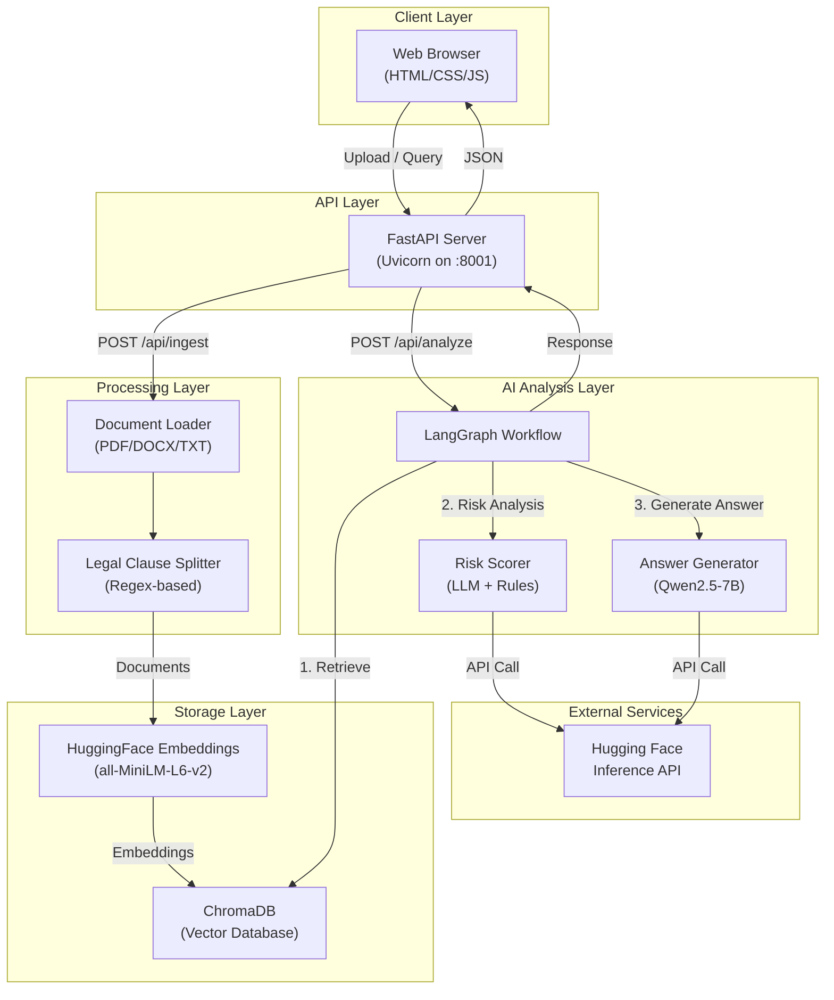
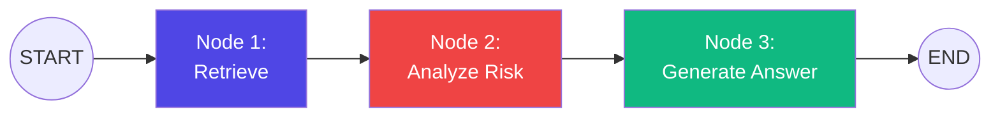

# AI Legal Policy & Document Analyzer: Architecture & System Design

## 1. High-Level System Architecture

The system follows a modular architecture that separates the web interface, the API layer, and the core processing logic.

## 2. Core Components Design

### 2.1 Web Server (FastAPI)
The backend leverages **FastAPI** for an asynchronous, high-performance REST API. 
- Serves static UI assets.
- Handles document ingestion via `UploadFile`.
- Exposes querying capabilities.

### 2.2 Vector Storage (ChromaDB)
- **Local Persistence:** Data is stored on disk in the `chroma_db/` directory via ChromaDB.
- **Embeddings:** Text is embedded using the `all-MiniLM-L6-v2` Sentence Transformer model running locally, avoiding latency and cost of external API calls for embeddings.

### 2.3 Hybrid Risk Scoring Engine
The application assesses risk using a hybrid approach:
- **LLM-Based Analysis:** Prompts a Hugging Face Qwen model to assess risk and provide recommendations.
- **Deterministic Rules Engine:** A hard-coded keyword analysis (`RiskRuleEngine`) supplements the LLM score, acting as a reliable safeguard to catch critical legal terms (e.g., unlimited indemnification, missing liability caps) consistently.

## 3. Workflow Pipeline (LangGraph)

The analysis workflow is orchestrated as a Directed Acyclic Graph (DAG) using LangGraph. This ensures robust state management across steps.

### State Object
The pipeline operates on a typed shared state (`GraphState`):
- `query`: The user's input string.
- `documents`: Retrieved vector matches (clauses).
- `risk_analysis`: List of assessed clauses with scores and recommendations.
- `final_answer`: Generated markdown response.
- `overall_report`: Aggregated risk profile.

## 4. Data Flow Sequences

### 4.1 Ingestion Flow
1. **Upload:** User provides a `.pdf`, `.docx`, or `.txt` file via the frontend.
2. **Extraction:** `DocumentLoader` extracts raw text from the file format.
3. **Splitting:** `LegalClauseSplitter` parses text using regex patterns (e.g., "ARTICLE I", "SECTION 5") into semantic legal clauses.
4. **Vectorization:** Clauses are passed to HuggingFace embeddings and stored in ChromaDB.

### 4.2 Analysis Flow
1. **Retrieval:** Extracts the top-5 relevant clauses from ChromaDB based on the query.
2. **Risk Analysis:** Passes clauses in batch to the `RiskScorer`. The Scorer relies on the LLM and `RiskRuleEngine` to evaluate each clause.
3. **Generation:** Generates a synthesized final response using Qwen, taking into account the retrieved clauses and the calculated risk scores.

## 5. Technology Stack Summary
- **Backend Framework:** FastAPI, Uvicorn
- **AI Orchestration:** LangChain, LangGraph
- **LLM/Embeddings:** Hugging Face API (Qwen2.5-7B), Sentence Transformers (all-MiniLM-L6-v2)
- **Vector DB:** ChromaDB
- **Frontend:** Vanilla HTML/JS/CSS
- **Deployment:** Docker, GitHub Actions to HF Spaces
